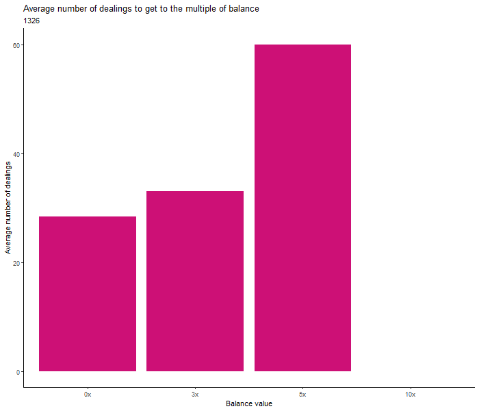

```{r setup, include=FALSE}
knitr::opts_chunk$set(echo = TRUE)
library(readr)
library("ggplot2")
library(dplyr)
```


 


\newpage


```{r fig.show = "hold", out.width = "50%", fig.align = "default", echo=FALSE}





```